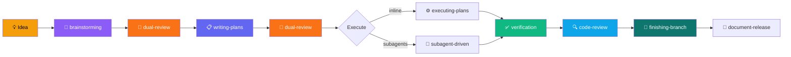
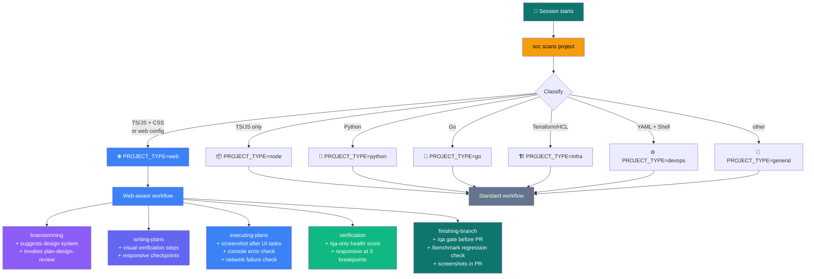
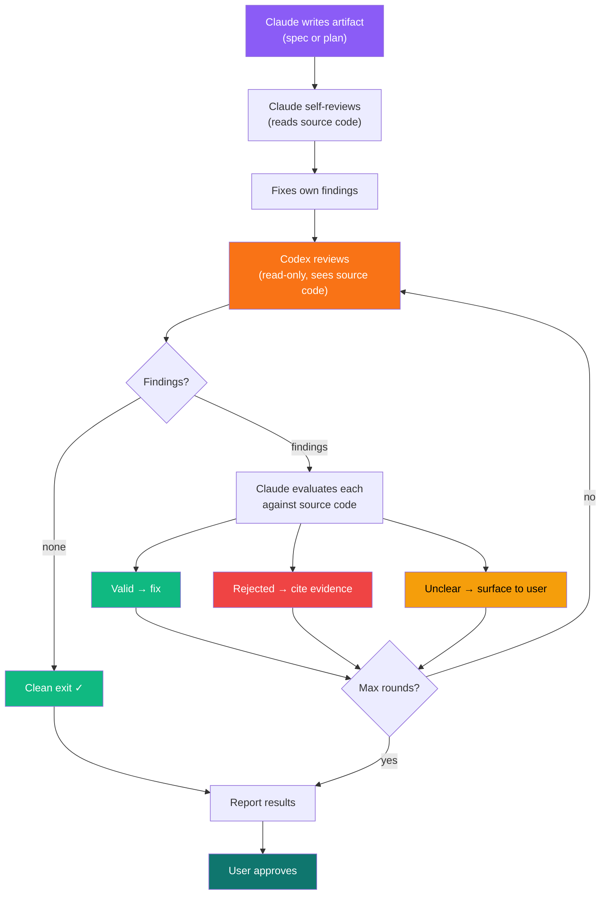
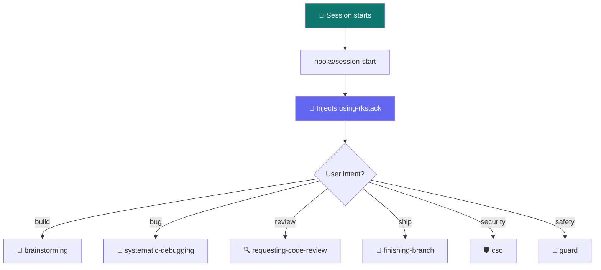

# 🛠️ RKstack

> 🤖 Engineering discipline system for AI coding agents.
>
> One plugin. 33 skills. Install once, adapts to your project.

[](https://github.com/mrkhachaturov/rkstack/actions/workflows/check.yml)
[](https://github.com/mrkhachaturov/rkstack/actions/workflows/update-refs.yml)


| | Scope | Meaning |
|---|-------|---------|
| 🧠 | Workflow | Full cycle: idea → spec → plan → implement → verify → review → ship |
| 🛡️ | Safety | PreToolUse hooks block destructive commands and scope-lock edits |
| 🔍 | Detection | scc detects your stack, preamble adapts behavior automatically |
| 🌐 | Web-aware | Browser daemon, visual QA, design review, responsive checks |
| 📐 | Platform-agnostic | Reads CLAUDE.md for commands, works with any stack |

> [!IMPORTANT]
> RKstack enforces discipline that prevents common AI agent failures:
> skipping tests, guessing at root causes, claiming things work without
> checking, and making destructive changes without warning.

---

## ⚡ Quick start

```bash
# Claude Code
/install-plugin rkstack@ccode-personal-plugins
```

That's it. Skills activate automatically based on what you're doing.

---

## 🗺️ The flow



Each step uses **test-driven-development** (RED → GREEN → REFACTOR). Bugs trigger **systematic-debugging** (5-phase investigation, 3-strike escalation). **humanizer** constraints activate during all prose writing (specs, plans, CHANGELOGs, docs).

---

## 🔍 Project-aware: same flow, different depth

At session start, `scc` scans your project and classifies it. The workflow stays the same, but **web projects get visual verification built into every step**, automatically.



**No config needed.** scc detects TypeScript + CSS + `next.config.ts`? You get browser-based QA, annotated screenshots, responsive checks, and design review, all injected into the same brainstorming → plans → execute → verify → ship flow.

Supabase detected (`.mcp.json` or `supabase/` directory)? Skills also verify data via MCP after browser actions, checking that what the user sees matches what the database stored.

Non-web projects (Go, Python, Terraform, DevOps) get the standard workflow with zero web-specific behavior.

---

## 🔄 Dual-review: Claude writes, Codex reviews

Specs and plans go through a multi-round review loop before you approve them. Claude self-reviews first, then Codex reviews independently against the source code. Claude evaluates each finding, fixes valid ones, rejects false positives with evidence. Rounds repeat until Codex comes back clean or max rounds are reached.



**Real example.** Reviewing a CLI distribution plan:

|   | Round 1    | Round 2    | Round 3 |
| --- | ---------- | ---------- | ------- |
| Codex findings | 10 | 3 | 1 |
| Valid (fixed) | 3 | 2 | 0 |
| Rejected | 7 | 1 | 1 |
| Result | tightening | converging | clean |

Each round gets tighter. Codex catches real issues Claude missed (missing CI path trigger, version mismatch guard). Claude rejects findings where Codex lacked context (standard Rust patterns, intentional parallelism). Three rounds, zero remaining issues.

```
/dual-review path/to/spec.md            # review any spec or plan
/dual-review path/to/plan.md --rounds 5 # up to 5 rounds
```

---

## 📦 Skills

### 🧠 Core workflow

| | Skill | What it does |
|---|-------|-------------|
| 💡 | **brainstorming** | Explore ideas before code. Design spec before implementation. |
| 📋 | **writing-plans** | Bite-sized TDD tasks. Exact file paths. No placeholders. |
| ⚙️ | **executing-plans** | Inline execution with checkpoints every 3 tasks. |
| 🤖 | **subagent-driven-development** | Fresh agent per task. Two-stage review. |
| 🧪 | **test-driven-development** | RED → GREEN → REFACTOR. No code without failing test. |
| ✅ | **verification-before-completion** | Prove it works before claiming done. |
| 🔍 | **requesting-code-review** | Two-pass review (CRITICAL → INFORMATIONAL). Fix-first. |
| 🚀 | **finishing-a-development-branch** | Test triage → merge/PR → cleanup. |

### 🔧 Quality & security

| | Skill | What it does |
|---|-------|-------------|
| 🐛 | **systematic-debugging** | 5-phase investigation. 3 strikes then escalate. |
| 🛡️ | **cso** | OWASP Top 10 + STRIDE security audit. |
| 📝 | **document-release** | Post-ship documentation audit and sync. |
| 📊 | **retro** | Weekly retrospective with commit analysis and trends. |
| 💬 | **receiving-code-review** | Respond to feedback with technical rigor. |
| ✍️ | **humanizer** | Write like a human. 35 anti-AI constraints active during composition. |
| 🔄 | **dual-review** | Claude writes, Codex reviews. Sequential rounds until clean. Source code is truth. |

### 🚧 Safety guardrails

| | Skill | What it does |
|---|-------|-------------|
| ⚠️ | **careful** | Warn before `rm -rf`, `DROP TABLE`, `force-push`. |
| 🔒 | **freeze** | Lock edits to one directory. Hard block. |
| 🛡️ | **guard** | Both careful + freeze at once. |
| 🔓 | **unfreeze** | Remove freeze restriction. |

### 🌐 Web

| | Skill | What it does |
|---|-------|-------------|
| 🌐 | **browse** | Headless browser: navigate, interact, screenshot, refs. |
| 🧪 | **qa** | Web QA: test + fix bugs with before/after evidence. |
| 📋 | **qa-only** | Report-only web QA: bugs documented, never fixed. |
| 🎨 | **design-review** | Visual QA: spacing, hierarchy, alignment + fixes. |
| 📐 | **plan-design-review** | Design review before implementation, rates 0-10. |
| 🖌️ | **design-consultation** | Create DESIGN.md with typography, color, layout, motion. |
| 🍪 | **setup-browser-cookies** | Import auth cookies from real browser. |
| ⏱️ | **benchmark** | Performance regression detection. Core Web Vitals. |
| 📡 | **canary** | Post-deploy monitoring. Console errors, regressions. |
| 🗄️ | **supabase-qa** | Supabase testing: auth, RLS, data consistency. |

### 🔩 Utility

| | Skill | What it does |
|---|-------|-------------|
| 🌳 | **using-git-worktrees** | Isolated workspaces for feature work. |
| ⚡ | **dispatching-parallel-agents** | Run independent tasks in parallel. |
| ✏️ | **writing-skills** | Create skills for your project. TDD for documentation. |

---

## 🏛️ Architecture

### 🔄 Session lifecycle



### 📐 Preamble tier system

Every skill gets a preamble, a bash block collecting project facts. Tiers control context depth:

| | Tier | Sections | Skills |
|---|------|----------|--------|
| 🟢 | T1 | Core detection + Escalation | using-rkstack, careful, freeze, guard, unfreeze |
| 🔵 | T2 | + AskUserQuestion Format + Completeness | brainstorming, debugging, plans, verification, +8 more |
| 🟣 | T3 | + Repo Ownership + Search Before Building | test-driven-development |
| 🔴 | T4 | Full context (gate-quality) | requesting-code-review, finishing-branch |

### 🔧 Template system

```
skills/{name}/SKILL.md.tmpl     ← human writes (content + {{PLACEHOLDERS}})
        │
        ▼  gen-skill-docs.ts    ← resolves placeholders from registry
        │
        ▼
skills/{name}/SKILL.md          ← generated, committed, read by Claude
```

Skills that reference official Claude Code docs (like `writing-skills`) include a `refs/` directory with auto-updated documentation from Anthropic. CI checks daily for upstream changes and bumps the plugin version when refs update, so your plugin stays current.

---

## 🧰 For contributors

```bash
just setup         # 📦 install tools via mise
just build         # 🔨 pull docs + generate all SKILL.md from templates
just dev-build     # 🔧 generate project-local dev skills with refs
just check         # ✅ verify generated files are fresh
just skill-check   # 🩺 health dashboard for all skills
just dev           # 👀 watch mode: auto-regen on change
bun test           # 🧪 run 450 tests (<8s)
```

| | Tool | Purpose |
|---|------|---------|
| 🧰 | `mise` | Installs bun, just, scc |
| ⚡ | `just` | Task runner |
| 📊 | `scc` | Tech stack detection |
| 🍞 | `bun` | TypeScript runtime + test runner |

See [CONTRIBUTING.md](CONTRIBUTING.md) for how to add skills and work with templates.
See [ARCHITECTURE.md](ARCHITECTURE.md) for why rkstack is built this way.
See [docs/WORKFLOW.md](docs/WORKFLOW.md) for the complete skill-to-skill flow with all cross-references.

---

## 💡 Philosophy

See [ETHOS.md](ETHOS.md) for the full builder philosophy:

| | Principle | What it means |
|---|-----------|--------------|
| 🌊 | **Completeness is cheap** | AI makes the last 10% near-free. Do it. |
| 🔎 | **Search before building** | Know what exists before you design. |
| 📋 | **Evidence before assertions** | Prove it works, don't claim it. |
| 🔌 | **Platform-agnostic** | Read from CLAUDE.md, never hardcode. |
| 🚨 | **Escalate, don't guess** | 3 strikes then stop. |

---

## 📄 License

MIT. See [LICENSE](LICENSE).

Upstream skills adapted from [gstack](https://github.com/garrytan/gstack)
and [superpowers](https://github.com/obra/superpowers). See
THIRD_PARTY_NOTICES.md for their licenses.
