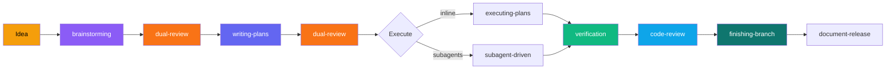
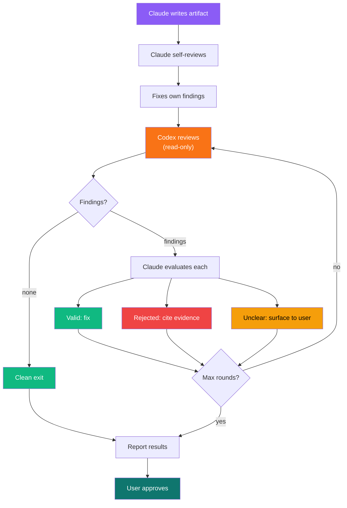
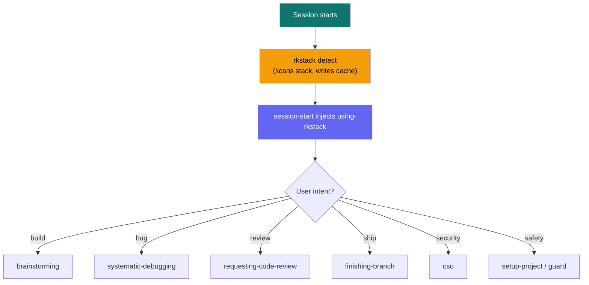

> **Engineering discipline system for AI coding agents.**
>
> One plugin. Install once, adapts to your project.

[](https://github.com/mrkhachaturov/rkstack/actions/workflows/check.yml)
[](https://github.com/mrkhachaturov/rkstack/actions/workflows/update-refs.yml)


| Scope | What it does |
|-------|-------------|
| Workflow | Full cycle: idea, spec, plan, implement, verify, review, ship |
| Safety | PreToolUse hooks block destructive commands and scope-lock edits |
| Detection | `rkstack detect` scans your stack, caches results per session |
| Flow types | Web projects get visual QA, screenshots, and responsive checks |
| Platform-agnostic | Reads CLAUDE.md for commands, works with any stack |

> [!IMPORTANT]
> RKstack enforces discipline that prevents common AI agent failures:
> skipping tests, guessing at root causes, claiming things work without
> checking, and making destructive changes without warning.

---

## Quick start

```bash
# Claude Code
/install-plugin rkstack@ccode-personal-plugins
```

Skills activate automatically based on what you're doing. Run `/setup-project` once to install project-level safety guards and working rules.

---

## The flow



Each step uses **test-driven-development** (RED, GREEN, REFACTOR). Bugs trigger **systematic-debugging** (5-phase investigation, 3-strike escalation). **humanizer** constraints activate during all prose writing.

---

## Stack detection and flow types

At session start, `rkstack detect` runs `scc` on your project, identifies every language and tool in use, and caches the result to `.rkstack/settings.json`. The cache looks like this:

```json
{
  "detection": {
    "flowType": "web",
    "stack": {
      "typescript": true,
      "css": true,
      "docker": true,
      "just": true
    },
    "stats": {
      "typescript": { "files": 46, "code": 9315, "complexity": 1150 }
    },
    "services": { "supabase": true },
    "repoMode": "solo",
    "totalCode": 44761
  }
}
```

The `stack` is a flat boolean map. Everything the project contains goes here: TypeScript, Python, Terraform, Docker, Ansible, Compose, just, mise. No hierarchy, no categories. `/setup-project` reads this to decide which guards and rules to offer.

The `flowType` controls how process skills behave. Today there are two:

| Flow type | When | What changes |
|-----------|------|-------------|
| `web` | TS/JS + CSS or web framework config detected | Brainstorming suggests design systems. Plans include visual verification steps. Execution screenshots after UI tasks. Verification checks responsive layouts. Code review includes visual regression. Shipping gates on QA. |
| `default` | Everything else | Standard workflow. No browser-based checks. |

More flow types will come as the system grows. If detection gets it wrong, override it: the `overrides` section in `.rkstack/settings.json` takes precedence over auto-detection.

Supabase detected (`.mcp.json` or `supabase/` directory)? Skills also verify data via MCP after browser actions, checking that what the user sees matches what the database stored.

---

## Dual-review: Claude writes, Codex reviews

Specs and plans go through a multi-round review loop before you approve them. Claude self-reviews first, then Codex reviews independently against the source code. Claude evaluates each finding, fixes valid ones, rejects false positives with evidence. Rounds repeat until Codex comes back clean or max rounds are reached.



Each round gets tighter. Codex catches issues Claude missed (missing CI path trigger, version mismatch guard). Claude rejects findings where Codex lacked context (standard patterns, intentional parallelism). Three rounds, zero remaining issues is common.

```
/dual-review path/to/spec.md            # review any spec or plan
/dual-review path/to/plan.md --rounds 5 # up to 5 rounds
```

---

## Skills

### Core workflow

| Skill | What it does |
|-------|-------------|
| **brainstorming** | Explore ideas before code. Design spec before implementation. |
| **writing-plans** | Bite-sized TDD tasks. Exact file paths. No placeholders. |
| **executing-plans** | Inline execution with checkpoints every 3 tasks. |
| **subagent-driven-development** | Fresh agent per task. Two-stage review. |
| **test-driven-development** | RED, GREEN, REFACTOR. No code without failing test. |
| **verification-before-completion** | Prove it works before claiming done. |
| **requesting-code-review** | Two-pass review (CRITICAL then INFORMATIONAL). Fix-first. |
| **finishing-a-development-branch** | Test triage, merge/PR, cleanup. |

### Quality and security

| Skill | What it does |
|-------|-------------|
| **systematic-debugging** | 5-phase investigation. 3 strikes then escalate. |
| **cso** | OWASP Top 10 + STRIDE security audit. |
| **document-release** | Post-ship documentation audit and sync. |
| **retro** | Weekly retrospective with commit analysis and trends. |
| **receiving-code-review** | Respond to feedback with technical rigor. |
| **humanizer** | Write like a person. 35 anti-AI constraints active during composition. |
| **dual-review** | Claude writes, Codex reviews. Sequential rounds until clean. |

### Safety guardrails

| Skill | What it does |
|-------|-------------|
| **setup-project** | Install project-level guards and working rules based on your stack. |
| **careful** | Warn before `rm -rf`, `DROP TABLE`, `force-push`. |
| **freeze** | Lock edits to one directory. Hard block. |
| **guard** | Both careful + freeze at once. |
| **unfreeze** | Remove freeze restriction. |

### Web

| Skill | What it does |
|-------|-------------|
| **browse** | Headless browser: navigate, interact, screenshot, element refs. |
| **qa** | Web QA: test and fix bugs with before/after evidence. |
| **qa-only** | Report-only web QA: bugs documented, never fixed. |
| **design-review** | Visual QA: spacing, hierarchy, alignment, then fixes. |
| **plan-design-review** | Design review before implementation, rates 0-10. |
| **design-consultation** | Create DESIGN.md with typography, color, layout, motion. |
| **setup-browser-cookies** | Import auth cookies from real browser. |
| **benchmark** | Performance regression detection. Core Web Vitals. |
| **canary** | Post-deploy monitoring. Console errors, regressions. |
| **supabase-qa** | Supabase testing: auth, RLS, data consistency. |

### Utility

| Skill | What it does |
|-------|-------------|
| **using-git-worktrees** | Isolated workspaces for feature work. |
| **dispatching-parallel-agents** | Run independent tasks in parallel. |
| **writing-skills** | Create skills for your project. TDD for documentation. |

---

## Architecture

### Session lifecycle



### Preamble tier system

Every skill gets a preamble that reads the detection cache and checks the current branch. Tiers control how much additional context is injected:

| Tier | Sections | Skills |
|------|----------|--------|
| T1 | Cache reader + Escalation | using-rkstack, careful, freeze, guard, unfreeze |
| T2 | + AskUserQuestion Format + Completeness | brainstorming, debugging, plans, verification, +9 more |
| T3 | + Repo Ownership + Search Before Building | test-driven-development |
| T4 | Full context (gate-quality) | requesting-code-review, finishing-branch |

### Template system

```
skills/{name}/SKILL.md.tmpl     <- human writes (content + {{PLACEHOLDERS}})
        |
        v  gen-skill-docs.ts    <- resolves placeholders from registry
        |
        v
skills/{name}/SKILL.md          <- generated, committed, read by Claude
```

Skills that reference Claude Code docs (like `writing-skills`) include a `refs/` directory with documentation from Anthropic. CI checks daily for upstream changes and bumps the plugin version when refs update.

---

## For contributors

```bash
just install       # install tools via mise
just build         # pull docs + generate all SKILL.md from templates
just dev-build     # generate project-local dev skills with refs
just check         # verify generated files are fresh
just skill-check   # health dashboard for all skills
just dev           # watch mode: auto-regen on change
bun test           # run tests
```

Modular justfile commands are in `.just/` (skills, upstream, setup modules). Run `just --list --list-submodules` to see everything.

| Tool | Purpose |
|------|---------|
| `mise` | Installs bun, just, scc |
| `just` | Task runner (modular: `.just/skills.just`, `.just/upstream.just`, `.just/setup.just`) |
| `scc` | Stack detection (called by `rkstack detect`) |
| `bun` | TypeScript runtime + test runner |

See [CONTRIBUTING.md](CONTRIBUTING.md) for how to add skills and work with templates.
See [ARCHITECTURE.md](ARCHITECTURE.md) for why rkstack is built this way.
See [docs/workflow.md](docs/workflow.md) for the complete skill-to-skill flow with all cross-references.

---

## Philosophy

See [ETHOS.md](ETHOS.md) for the full builder philosophy:

| Principle | What it means |
|-----------|--------------|
| Completeness is cheap | AI makes the last 10% near-free. Do it. |
| Search before building | Know what exists before you design. |
| Evidence before assertions | Prove it works, don't claim it. |
| Platform-agnostic | Read from CLAUDE.md, never hardcode. |
| Escalate, don't guess | 3 strikes then stop. |

---

## License

MIT. See [LICENSE](LICENSE).

Upstream skills adapted from [gstack](https://github.com/garrytan/gstack)
and [superpowers](https://github.com/obra/superpowers). See
THIRD_PARTY_NOTICES.md for their licenses.
