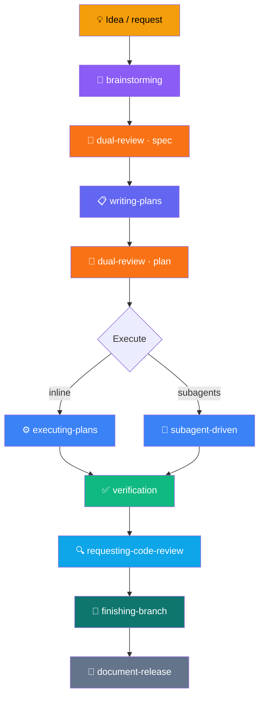
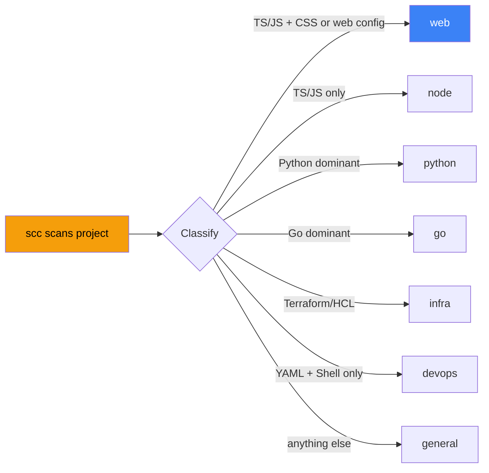
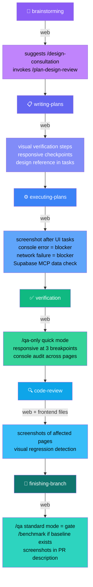

# RKstack workflow

How the skills connect, from session start to shipped code.

## Session lifecycle

```
Session starts
  │
  ▼
hooks/session-start injects using-rkstack/SKILL.md
  + detects PROJECT_TYPE, HAS_SUPABASE
  + checks .rkstack/settings.json for setup state
  + suggests /setup-project if missing or stale
  │
  ▼
Claude reads using-rkstack:
  - instruction priority (user > skills > defaults)
  - proactive skill suggestions (intent → skill mapping)
  - the Rule: invoke skills BEFORE any response
  │
  ▼
User works: skills activate based on intent
```

## The core flow



| Step | Skill | What happens |
|------|-------|-------------|
| Design | **brainstorming** (T2) | Explore ideas, write design spec. humanizer active. |
| Review spec | **dual-review** (T2) | Claude self-reviews → Codex reviews → rounds until clean. Source code is truth. |
| Plan | **writing-plans** (T2) | TDD tasks, exact file paths, no placeholders. Smart decomposition if needed. humanizer active. |
| Review plan | **dual-review** (T2) | Same loop. Checks plan against spec + source code. |
| Execute | **executing-plans** or **subagent-driven** (T2) | TDD per task. Commits reference plan ID. |
| Verify | **verification-before-completion** (T2) | Evidence before assertions. Run command, read output, prove claims. |
| Code review | **requesting-code-review** (T4) | Two-pass: CRITICAL then INFORMATIONAL. Fix-first. Suggests finishing-branch. |
| Ship | **finishing-a-development-branch** (T4) | Test triage, merge/PR, CHANGELOG. humanizer active. Suggests document-release. |
| Docs | **document-release** (T2) | Audit .md files against diff. Auto-update factual content. humanizer active. |

## When bugs happen

```
Bug / test failure / unexpected behavior
  │
  ▼
┌─────────────────┐
│  systematic-     │  T2: 5-phase investigation
│  debugging       │  Phase 1: Root cause investigation
│                  │  Phase 2: Pattern analysis (6 known patterns)
│                  │  Phase 3: Hypothesis testing (3-strike rule)
│                  │  Phase 4: Implementation (TDD, minimal diff)
│                  │  Phase 5: Verification report
│                  │
│                  │  Freeze hooks prevent edit scope creep
│                  │  3+ failed fixes → STOP and escalate
└─────────────────┘
```

## Safety guardrails

```
┌──────────────────────────────────────────────────┐
│  /setup-project                                   │
│    One-time project setup: analyzes stack,         │
│    generates .claude/hooks/ guards + .claude/rules │
│    Always-on protection (no skill invocation)      │
│    Session-start suggests it if not configured     │
│                                                   │
│  guard = careful + freeze                         │
│                                                   │
│  careful (PreToolUse → Bash)                      │
│    Warns before: rm -rf, DROP TABLE, force-push,  │
│    reset --hard, kubectl delete, docker prune     │
│    Safe exceptions: node_modules, dist, .cache    │
│    Decision: "ask" (user can override)            │
│                                                   │
│  freeze (PreToolUse → Edit/Write)                 │
│    Restricts edits to a specified directory        │
│    Decision: "deny" (hard block)                  │
│    State: ${CLAUDE_PLUGIN_DATA}/freeze-dir.txt    │
│    Used by: systematic-debugging (auto-scopes)    │
└──────────────────────────────────────────────────┘
```

## Preamble tier system

Every skill gets a preamble injected at the top. The tier controls how much context:

| Tier | Sections Included | Skills |
|------|------------------|--------|
| T1 | Core bash (scc, branch, repo-mode) + Completion Status + Escalation | using-rkstack, careful, freeze, guard, unfreeze, browse, setup-browser-cookies, benchmark |
| T2 | T1 + AskUserQuestion Format + Completeness Principle | brainstorming, systematic-debugging, writing-plans, verification, executing-plans, subagent-driven, parallel-agents, worktrees, receiving-review, writing-skills, document-release, retro, cso, humanizer, dual-review, canary |
| T3 | T2 + Repo Ownership + Search Before Building | TDD, plan-design-review, design-consultation, supabase-qa |
| T4 | T3 (gate-quality skills) | requesting-code-review, finishing-a-development-branch, qa, qa-only, design-review |

**AskUserQuestion Format** (T2+): re-ground → simplify → recommend → options with Completeness scoring

**Completeness Principle** (T2+): always recommend complete option, show effort table (human vs AI)

**Repo Ownership** (T3+): solo = fix proactively, collaborative = flag and ask

**Search Before Building** (T3+): Layer 1 (tried-and-true) → Layer 2 (new-and-popular) → Layer 3 (first principles)

## Template system

Skills are built from templates:

```
skills/{name}/SKILL.md.tmpl     ← human writes (frontmatter + {{PLACEHOLDERS}})
        │
        ▼  gen-skill-docs.ts
        │  resolves: {{PREAMBLE}}, {{BASE_BRANCH_DETECT}}, {{TEST_FAILURE_TRIAGE}}
        │
        ▼
skills/{name}/SKILL.md          ← generated, committed, read by Claude at load time
```

Build commands:
- `just build`: generate all SKILL.md from templates
- `just check`: verify generated files are fresh
- `just skill-check`: health dashboard (frontmatter validation, template coverage, freshness)
- `just dev`: watch mode (auto-regen on change)

## Resolver registry

| Placeholder | What it generates | Used by |
|------------|-------------------|---------|
| `{{PREAMBLE}}` | Tiered preamble (bash + prose sections) | Every skill |
| `{{BASE_BRANCH_DETECT}}` | Platform-aware base branch detection (GitHub, GitLab, git) | requesting-code-review, finishing-branch |
| `{{TEST_FAILURE_TRIAGE}}` | Test failure ownership classification | finishing-branch |

## Companion files

Hand-authored files that live alongside templates. NOT processed by gen-skill-docs.

| Skill | Companion | Purpose |
|-------|-----------|---------|
| brainstorming | visual-companion.md | Browser-based mockup guide |
| brainstorming | spec-document-reviewer-prompt.md | Spec review prompt |
| systematic-debugging | root-cause-tracing.md | Backward call-chain tracing technique |
| systematic-debugging | defense-in-depth.md | Four-layer validation after fix |
| test-driven-development | testing-anti-patterns.md | 5 anti-patterns with gate functions |
| requesting-code-review | code-reviewer.md | Prompt template for reviewer agent |
| writing-plans | plan-document-reviewer-prompt.md | Plan review prompt |
| dual-review | spec-review-prompt.md | Codex prompt for spec review |
| dual-review | plan-review-prompt.md | Codex prompt for plan review |

## Agent definitions

| Agent | File | Purpose |
|-------|------|---------|
| code-reviewer | agents/code-reviewer.md | Two-pass review (CRITICAL/INFORMATIONAL), fix-first classification |

## Cross-skill references

- **brainstorming** → runs **dual-review** on spec, then invokes **writing-plans**
- **brainstorming** → applies **humanizer** constraints during spec writing
- **writing-plans** → runs **dual-review** on plan, then offers **subagent-driven-development** or **executing-plans**
- **writing-plans** → applies **humanizer** constraints for plan header prose
- **executing-plans** → references **test-driven-development** for TDD tasks, **verification-before-completion** before completion
- **subagent-driven-development** → runs **verification-before-completion** gate before final review
- **requesting-code-review** → dispatches **code-reviewer** agent, suggests **finishing-a-development-branch**
- **finishing-a-development-branch** → applies **humanizer** for CHANGELOG/PR, suggests **document-release**
- **finishing-a-development-branch** → uses **TEST_FAILURE_TRIAGE** from preamble
- **document-release** → applies **humanizer** constraints for doc prose
- **retro** → applies **humanizer** constraints for narrative output
- **systematic-debugging** → uses **freeze** hooks for scope locking, references **TDD** and **verification**
- **guard** → chains **careful** (Bash) + **freeze** (Edit/Write)
- **dispatching-parallel-agents** → references **verification-before-completion**
- **receiving-code-review** → references **verification-before-completion**

## Execution skills

```
Plan ready
  │
  ├──▶ executing-plans (T2)         — inline, same session, checkpoint every 3 tasks
  │
  └──▶ subagent-driven-development  — fresh agent per task, two-stage review
       (T2)                           (spec compliance → code quality)
       Uses: implementer-prompt.md, spec-reviewer-prompt.md,
             code-quality-reviewer-prompt.md

Both use: test-driven-development for each task
Both use: verification-before-completion before claiming done
Both end with: requesting-code-review → finishing-branch
```

## Parallel & isolation

```
dispatching-parallel-agents (T2)    using-git-worktrees (T2)
  │                                   │
  Tasks MUST be independent           Isolated workspace for feature work
  No shared files                     Smart directory selection
  Dispatch all in single message      Safety verification before start
  Review for conflicts after          Cleanup on completion
```

## Post-ship & analysis

```
PR merged
  │
  ├──▶ document-release (T2)    — audit .md files against diff, auto-update
  │                                factual content, gate risky changes,
  │                                polish CHANGELOG, cross-doc consistency
  │
  └──▶ retro (T2)               — weekly engineering retrospective
                                   commit analysis, session detection,
                                   focus scoring, team breakdown, trends
```

## Project type detection

At session start, the session-start hook runs `scc` on the project root and classifies it:



The result is injected into session context as `PROJECT_TYPE=web` (or node, python, go, etc.). Skills read this and adapt their behavior. No configuration needed.

**Web detection signals:** TypeScript or JavaScript **AND** (CSS/HTML/SCSS detected **OR** web framework config: `next.config.*`, `vite.config.*`, `nuxt.config.*`, `svelte.config.*`, `angular.json`).

**Service detection:** If `.mcp.json` contains a `"supabase"` key or a `supabase/` directory exists, `HAS_SUPABASE=yes` is also injected.

## Web-aware workflow

When `PROJECT_TYPE=web`, the same core flow (brainstorming → plans → execute → verify → ship) gains visual verification at every stage. Non-web projects are completely unaffected.



**The browser daemon** (`rkstack-browse`) powers all visual verification. It's a persistent headless Chromium with an accessibility-tree ref system (`@e1`, `@e2` for DOM elements), annotated screenshots, responsive breakpoints, and console/network capture. Auto-starts on first command, shuts down after 30 min idle.

**Supabase integration:** When `HAS_SUPABASE=yes`, skills verify data via Supabase MCP after browser actions (form submit → check database, auth flow → check session table, mutations → check RLS).

## Security

```
cso (T2): Chief Security Officer audit
  │
  Phases 0-12: architecture model → attack surface → secrets →
  supply chain → CI/CD → infrastructure → webhooks → LLM security →
  OWASP Top 10 → STRIDE → data classification → FP filter → report
  │
  Modes: /cso (full), --diff (branch), --owasp, --infra, --code
```

## Meta skills

| Skill | Tier | Purpose |
|-------|------|---------|
| writing-skills | T2 | Create/edit skills: template system, frontmatter, tiers, testing |
| receiving-code-review | T2 | Respond to review feedback with technical rigor, not blind agreement |

## Library

| Module | File | Purpose |
|--------|------|---------|
| WorktreeManager | lib/worktree.ts | Git worktree isolation: create, harvest patches, cleanup, dedup |

## All skills

| Skill | Tier | Source | Category |
|-------|------|--------|----------|
| using-rkstack | T1 | superpowers + gstack | Root / session entry |
| brainstorming | T2 | superpowers | Design |
| careful | T1 | gstack | Safety |
| freeze | T1 | gstack | Safety |
| guard | T1 | gstack | Safety |
| unfreeze | T1 | gstack | Safety |
| setup-project | T2 | rkstack (original) | Safety |
| systematic-debugging | T2 | gstack /investigate + superpowers | Quality |
| writing-plans | T2 | superpowers (enriched) | Planning |
| verification-before-completion | T2 | superpowers (enriched) | Quality |
| executing-plans | T2 | superpowers (enriched) | Execution |
| subagent-driven-development | T2 | superpowers (adapted) | Execution |
| dispatching-parallel-agents | T2 | superpowers (enriched) | Execution |
| using-git-worktrees | T2 | superpowers (adapted) | Utility |
| receiving-code-review | T2 | superpowers (adapted) | Quality |
| writing-skills | T2 | superpowers + rkstack | Meta |
| document-release | T2 | gstack (adapted) | Post-ship |
| retro | T2 | gstack (core adapted) | Analysis |
| humanizer | T2 | yoloshii/humanizer-pro (adapted) | Quality |
| dual-review | T2 | rkstack (original, inspired by gstack /codex) | Quality |
| test-driven-development | T3 | superpowers (enriched) | Quality |
| cso | T2 | gstack (adapted) | Security |
| requesting-code-review | T4 | gstack /review + superpowers | Quality |
| finishing-a-development-branch | T4 | gstack /ship + superpowers | Shipping |
| browse | T1 | gstack (adapted) | Web |
| qa | T4 | gstack (adapted) | Web |
| qa-only | T4 | gstack (adapted) | Web |
| design-review | T4 | gstack (adapted) | Web |
| plan-design-review | T3 | gstack (adapted) | Web |
| design-consultation | T3 | gstack (adapted) | Web |
| setup-browser-cookies | T1 | gstack (adapted) | Web |
| benchmark | T1 | gstack (adapted) | Web |
| canary | T2 | gstack (adapted) | Web |
| supabase-qa | T3 | rkstack (original) | Web |
