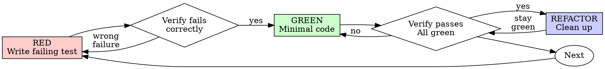

<!-- AUTO-GENERATED from SKILL.md.tmpl — do not edit directly -->
<!-- Regenerate: just build -->

## Preamble (run first)

```bash
# === RKstack Preamble (test-driven-development) ===

# Project detection via scc — single source of truth for languages AND frameworks
_SCC_OUT=$(scc --format wide --no-cocomo --exclude-dir 3rdparty-src . 2>/dev/null | head -15 || echo "scc not available")
echo "STACK:"
echo "$_SCC_OUT"

# Derive language frameworks from scc output (recursive, catches subdirs/submodules)
_HAS_TS=$( echo "$_SCC_OUT" | grep -qi "TypeScript"  && echo "yes" || echo "no")
_HAS_JS=$( echo "$_SCC_OUT" | grep -qi "JavaScript"  && echo "yes" || echo "no")
_HAS_PY=$( echo "$_SCC_OUT" | grep -qi "Python"      && echo "yes" || echo "no")
_HAS_GO=$( echo "$_SCC_OUT" | grep -qi "^Go "         && echo "yes" || echo "no")
_HAS_RS=$( echo "$_SCC_OUT" | grep -qi "Rust"         && echo "yes" || echo "no")
_HAS_JAVA=$(echo "$_SCC_OUT" | grep -qi "Java "       && echo "yes" || echo "no")
_HAS_CS=$( echo "$_SCC_OUT" | grep -qi "C#"           && echo "yes" || echo "no")
_HAS_RB=$( echo "$_SCC_OUT" | grep -qi "Ruby"         && echo "yes" || echo "no")
echo "LANGS: ts=$_HAS_TS js=$_HAS_JS py=$_HAS_PY go=$_HAS_GO rs=$_HAS_RS java=$_HAS_JAVA cs=$_HAS_CS rb=$_HAS_RB"

# Tooling hints (non-language markers — scc doesn't detect these)
_HAS_DOCKER=$(  [ -f Dockerfile ] && echo "yes" || echo "no")
_HAS_TF=$(      echo "$_SCC_OUT" | grep -qi "Terraform\|HCL" && echo "yes" || echo "no")
_HAS_ANSIBLE=$( echo "$_SCC_OUT" | grep -qi "Ansible\|YAML" && { [ -d ansible ] || [ -f ansible.cfg ] || find . -maxdepth 2 -name "*.yml" -path "*/playbooks/*" -print -quit 2>/dev/null | grep -q .; } && echo "yes" || echo "no")
_HAS_COMPOSE=$( [ -f docker-compose.yml ] || [ -f docker-compose.yaml ] || [ -f compose.yml ] || [ -f compose.yaml ] && echo "yes" || echo "no")
_HAS_JUST=$(    [ -f justfile ] || [ -f Justfile ] && echo "yes" || echo "no")
_HAS_MISE=$(    [ -f .mise.toml ] || [ -f mise.toml ] && echo "yes" || echo "no")
echo "TOOLS: docker=$_HAS_DOCKER tf=$_HAS_TF ansible=$_HAS_ANSIBLE compose=$_HAS_COMPOSE just=$_HAS_JUST mise=$_HAS_MISE"

# Repo mode (solo vs collaborative)
_AUTHOR_COUNT=$(git shortlog -sn --no-merges --since="90 days ago" 2>/dev/null | wc -l | tr -d ' ')
_REPO_MODE=$([ "$_AUTHOR_COUNT" -le 1 ] && echo "solo" || echo "collaborative")
_BRANCH=$(git branch --show-current 2>/dev/null || echo "unknown")
echo "REPO_MODE: $_REPO_MODE"
echo "BRANCH: $_BRANCH"

# Project config
_HAS_CLAUDE_MD=$([ -f CLAUDE.md ] && echo "yes" || echo "no")
echo "CLAUDE_MD: $_HAS_CLAUDE_MD"
```

Use the preamble output to adapt your behavior:
- **TypeScript/JavaScript** — web/fullstack project. Check for React/Vue/Svelte patterns.
- **Python** — backend/ML/scripts. Check PEP8 conventions, pytest for testing.
- **Go** — backend/infra. Check error handling patterns, go test.
- **Rust** — systems. Check ownership patterns, cargo test.
- **Java/C#** — enterprise. Check build tool (Maven/Gradle/.NET), framework conventions.
- **Ruby** — web/scripting. Check Gemfile, Rails conventions if present.
- **Terraform/HCL** — infrastructure as code. Plan before apply, extra caution with state.
- **Ansible** — configuration management. Check inventory, role conventions, vault usage.
- **Docker/Compose** — containerized. Check service dependencies, .env patterns.
- **justfile** — task runner present. Use `just` commands instead of raw shell.
- **mise** — tool version manager. Versions are pinned — don't suggest global installs.
- **CLAUDE.md exists** — read it for project-specific commands and conventions.

```bash
# === rkstack bootstrap ===
RKSTACK_BIN="${CLAUDE_PLUGIN_DATA}/bin/rkstack"
WANT_VERSION=$(cat "${CLAUDE_PLUGIN_ROOT}/VERSION")
if [ ! -x "$RKSTACK_BIN" ] || [ "$("$RKSTACK_BIN" version 2>/dev/null)" != "$WANT_VERSION" ]; then
  OS=$(uname -s | tr '[:upper:]' '[:lower:]')
  ARCH=$(uname -m)
  ASSET="rkstack-${OS}-${ARCH}"
  URL="https://github.com/mrkhachaturov/rkstack/releases/download/v${WANT_VERSION}/${ASSET}"
  mkdir -p "${CLAUDE_PLUGIN_DATA}/bin"
  FAIL_MARKER="${CLAUDE_PLUGIN_DATA}/bin/.download-failed"
  find "${CLAUDE_PLUGIN_DATA}/bin" -name ".download-failed" -mmin +60 -delete 2>/dev/null || true
  if [ -f "$FAIL_MARKER" ]; then
    echo "RKSTACK_BIN_UNAVAILABLE (download failed this session, will retry next session)"
  else
    TMPBIN="${RKSTACK_BIN}.tmp.$$"
    if curl --connect-timeout 5 --max-time 30 -fsSL "$URL" -o "$TMPBIN" 2>/dev/null \
       && chmod +x "$TMPBIN" \
       && [ "$("$TMPBIN" version 2>/dev/null)" = "$WANT_VERSION" ]; then
      mv -f "$TMPBIN" "$RKSTACK_BIN"
      rm -f "$FAIL_MARKER"
    else
      rm -f "$TMPBIN"
      touch "$FAIL_MARKER"
      echo "RKSTACK_BIN_UNAVAILABLE (download failed or platform ${OS}-${ARCH} not supported)"
    fi
  fi
fi
```

If `RKSTACK_BIN_UNAVAILABLE` is printed above, skills fall back to inline bash — no action needed.

## AskUserQuestion Format

**ALWAYS follow this structure for every AskUserQuestion call:**
1. **Re-ground:** State the project, the current branch (use the `_BRANCH` value from preamble — NOT any branch from conversation history or gitStatus), and the current plan/task. (1-2 sentences)
2. **Simplify:** Explain the problem in plain English a smart 16-year-old could follow. No raw function names, no internal jargon, no implementation details. Use concrete examples and analogies. Say what it DOES, not what it's called.
3. **Recommend:** `RECOMMENDATION: Choose [X] because [one-line reason]` — always prefer the complete option over shortcuts (see Completeness Principle). Include `Completeness: X/10` for each option. Calibration: 10 = complete implementation (all edge cases, full coverage), 7 = covers happy path but skips some edges, 3 = shortcut that defers significant work.
4. **Options:** Lettered options: `A) ... B) ... C) ...` — when an option involves effort, show both scales: `(human: ~X / CC: ~Y)`

Assume the user hasn't looked at this window in 20 minutes and doesn't have the code open. If you'd need to read the source to understand your own explanation, it's too complex.

## Completeness Principle

AI makes completeness near-free. Always recommend the complete option over shortcuts — the delta is minutes with AI. A "lake" (100% coverage, all edge cases) is boilable; an "ocean" (full rewrite, multi-quarter migration) is not. Boil lakes, flag oceans.

**Effort reference** — always show both scales:

| Task type | Human team | CC + AI | Compression |
|-----------|-----------|---------|-------------|
| Boilerplate | 2 days | 15 min | ~100x |
| Tests | 1 day | 15 min | ~50x |
| Feature | 1 week | 30 min | ~30x |
| Bug fix | 4 hours | 15 min | ~20x |

Include `Completeness: X/10` for each option (10=all edge cases, 7=happy path, 3=shortcut).

## Repo Ownership

`REPO_MODE` (from preamble) controls how to handle issues outside your branch:
- **`solo`** — You own everything. Investigate and offer to fix proactively.
- **`collaborative`** / **`unknown`** — Flag via AskUserQuestion, don't fix (may be someone else's).

Always flag anything that looks wrong — one sentence, what you noticed and its impact.

## Search Before Building

Before building anything unfamiliar, **search first.**
- **Layer 1** (tried and true) — standard patterns, built-in to the runtime/framework. Don't reinvent.
- **Layer 2** (new and popular) — blog posts, trending approaches. Scrutinize — people follow hype.
- **Layer 3** (first principles) — your own reasoning about the specific problem. Prize above all.

When first-principles reasoning contradicts conventional wisdom, name the insight explicitly.

## Completion Status

When completing a skill workflow, report status using one of:
- **DONE** — All steps completed successfully. Evidence provided for each claim.
- **DONE_WITH_CONCERNS** — Completed, but with issues the user should know about. List each concern.
- **BLOCKED** — Cannot proceed. State what is blocking and what was tried.
- **NEEDS_CONTEXT** — Missing information required to continue. State exactly what you need.

### Escalation

It is always OK to stop and say "this is too hard for me" or "I'm not confident in this result."

Bad work is worse than no work. You will not be penalized for escalating.
- If you have attempted a task 3 times without success, STOP and escalate.
- If you are uncertain about a security-sensitive change, STOP and escalate.
- If the scope of work exceeds what you can verify, STOP and escalate.

Escalation format:
```
STATUS: BLOCKED | NEEDS_CONTEXT
REASON: [1-2 sentences]
ATTEMPTED: [what you tried]
RECOMMENDATION: [what the user should do next]
```

# Test-Driven Development (TDD)

Write the test first. Watch it fail. Write minimal code to pass.

**Core principle:** If you didn't watch the test fail, you don't know if it tests the right thing.

**Violating the letter of the rules is violating the spirit of the rules.**

## When to Use

**Always:**
- New features
- Bug fixes
- Refactoring
- Behavior changes

**Exceptions (ask your human partner):**
- Throwaway prototypes
- Generated code
- Configuration files

Thinking "skip TDD just this once"? Stop. That's rationalization.

---

## Test Framework Bootstrap

Before writing any test, detect the project's test framework. NEVER hardcode framework commands.

**Step 1. Read CLAUDE.md** for a `## Testing` section with test command and framework name. If found, use that as the authoritative source. Skip to Step 4.

**Step 2. If CLAUDE.md has no testing section, auto-detect:**

```bash
# Detect project runtime
[ -f Gemfile ] && echo "RUNTIME:ruby"
[ -f package.json ] && echo "RUNTIME:node"
[ -f requirements.txt ] || [ -f pyproject.toml ] && echo "RUNTIME:python"
[ -f go.mod ] && echo "RUNTIME:go"
[ -f Cargo.toml ] && echo "RUNTIME:rust"
[ -f composer.json ] && echo "RUNTIME:php"
[ -f mix.exs ] && echo "RUNTIME:elixir"
# Check for existing test infrastructure
ls jest.config.* vitest.config.* playwright.config.* .rspec pytest.ini phpunit.xml 2>/dev/null
ls -d test/ tests/ spec/ __tests__/ cypress/ e2e/ 2>/dev/null
```

**If test framework detected** (config files or test directories found):
Print "Test framework detected: {name}. Using {test command}."
Read 2-3 existing test files to learn conventions (naming, imports, assertion style, setup patterns).
Store conventions as prose context for use throughout TDD. Skip to Step 4.

**Step 3. If runtime detected but no test framework** — use AskUserQuestion:

> I detected this is a {Runtime} project with no test framework configured. Here are the recommended options:
> A) {Primary recommendation} -- {rationale}. Includes: {packages}
> B) {Alternative} -- {rationale}. Includes: {packages}
> C) Skip -- don't set up testing right now (NOT RECOMMENDED for TDD)
> RECOMMENDATION: Choose A because {reason based on project context}

**Built-in recommendation table** (use when you cannot search):

| Runtime | Primary recommendation | Alternative |
|---------|----------------------|-------------|
| Ruby/Rails | minitest + fixtures | rspec + factory_bot |
| Node.js/Bun | vitest + @testing-library | jest + @testing-library |
| Next.js | vitest + @testing-library/react | jest + cypress |
| Python | pytest + pytest-cov | unittest |
| Go | stdlib testing + testify | stdlib only |
| Rust | cargo test (built-in) | -- |
| PHP | phpunit + mockery | pest |
| Elixir | ExUnit (built-in) | -- |

If user picks C, note "Test framework skipped by user" and continue -- but warn that TDD requires a test runner.

If the user picks A or B:
1. Install the chosen packages
2. Create minimal config file
3. Create directory structure (test/, spec/, etc.)
4. Verify with one smoke test

**Step 4. Persist to CLAUDE.md.** If CLAUDE.md has no `## Testing` section, append one:
```
## Testing
- Run: {detected or chosen test command}
- Framework: {name}
- Directory: {test dir}
```

This ensures the test command is never asked for again.

---

## The Iron Law

```
NO PRODUCTION CODE WITHOUT A FAILING TEST FIRST
```

Write code before the test? Delete it. Start over.

**No exceptions:**
- Don't keep it as "reference"
- Don't "adapt" it while writing tests
- Don't look at it
- Delete means delete

Implement fresh from tests. Period.

---

## Red-Green-Refactor



### RED - Write Failing Test

Write one minimal test showing what should happen.

<Good>
```typescript
test('retries failed operations 3 times', async () => {
  let attempts = 0;
  const operation = () => {
    attempts++;
    if (attempts < 3) throw new Error('fail');
    return 'success';
  };

  const result = await retryOperation(operation);

  expect(result).toBe('success');
  expect(attempts).toBe(3);
});
```
Clear name, tests real behavior, one thing
</Good>

<Bad>
```typescript
test('retry works', async () => {
  const mock = jest.fn()
    .mockRejectedValueOnce(new Error())
    .mockRejectedValueOnce(new Error())
    .mockResolvedValueOnce('success');
  await retryOperation(mock);
  expect(mock).toHaveBeenCalledTimes(3);
});
```
Vague name, tests mock not code
</Bad>

**Requirements:**
- One behavior
- Clear name
- Real code (no mocks unless unavoidable)

**Use the test command from the Bootstrap section.** Never hardcode `npm test` or `bun test` -- use whatever was detected or configured.

### Verify RED - Watch It Fail

**MANDATORY. Never skip.**

```bash
{test command} path/to/test.test.ts
```

Confirm:
- Test fails (not errors)
- Failure message is expected
- Fails because feature missing (not typos)

**Test passes?** You're testing existing behavior. Fix test.

**Test errors?** Fix error, re-run until it fails correctly.

### GREEN - Minimal Code

Write simplest code to pass the test.

<Good>
```typescript
async function retryOperation<T>(fn: () => Promise<T>): Promise<T> {
  for (let i = 0; i < 3; i++) {
    try {
      return await fn();
    } catch (e) {
      if (i === 2) throw e;
    }
  }
  throw new Error('unreachable');
}
```
Just enough to pass
</Good>

<Bad>
```typescript
async function retryOperation<T>(
  fn: () => Promise<T>,
  options?: {
    maxRetries?: number;
    backoff?: 'linear' | 'exponential';
    onRetry?: (attempt: number) => void;
  }
): Promise<T> {
  // YAGNI
}
```
Over-engineered
</Bad>

Don't add features, refactor other code, or "improve" beyond the test.

### Verify GREEN - Watch It Pass

**MANDATORY.**

```bash
{test command} path/to/test.test.ts
```

Confirm:
- Test passes
- Other tests still pass
- Output pristine (no errors, warnings)

**Test fails?** Fix code, not test.

**Other tests fail?** Fix now.

### REFACTOR - Clean Up

After green only:
- Remove duplication
- Improve names
- Extract helpers

Keep tests green. Don't add behavior.

### Repeat

Next failing test for next feature.

---

## What Makes a Good Test

| Quality | Good | Bad |
|---------|------|-----|
| **Minimal** | One thing. "and" in name? Split it. | `test('validates email and domain and whitespace')` |
| **Clear** | Name describes behavior | `test('test1')` |
| **Shows intent** | Demonstrates desired API | Obscures what code should do |

---

## Why Order Matters

**"I'll write tests after to verify it works"**

Tests written after code pass immediately. Passing immediately proves nothing:
- Might test wrong thing
- Might test implementation, not behavior
- Might miss edge cases you forgot
- You never saw it catch the bug

Test-first forces you to see the test fail, proving it actually tests something.

**"I already manually tested all the edge cases"**

Manual testing is ad-hoc. You think you tested everything but:
- No record of what you tested
- Can't re-run when code changes
- Easy to forget cases under pressure
- "It worked when I tried it" does not equal comprehensive

Automated tests are systematic. They run the same way every time.

**"Deleting X hours of work is wasteful"**

Sunk cost fallacy. The time is already gone. Your choice now:
- Delete and rewrite with TDD (X more hours, high confidence)
- Keep it and add tests after (30 min, low confidence, likely bugs)

The "waste" is keeping code you can't trust. Working code without real tests is technical debt.

**"TDD is dogmatic, being pragmatic means adapting"**

TDD IS pragmatic:
- Finds bugs before commit (faster than debugging after)
- Prevents regressions (tests catch breaks immediately)
- Documents behavior (tests show how to use code)
- Enables refactoring (change freely, tests catch breaks)

"Pragmatic" shortcuts = debugging in production = slower.

**"Tests after achieve the same goals -- it's spirit not ritual"**

No. Tests-after answer "What does this do?" Tests-first answer "What should this do?"

Tests-after are biased by your implementation. You test what you built, not what's required. You verify remembered edge cases, not discovered ones.

Tests-first force edge case discovery before implementing. Tests-after verify you remembered everything (you didn't).

30 minutes of tests after does not equal TDD. You get coverage, lose proof tests work.

---

## Common Rationalizations

| Excuse | Reality |
|--------|---------|
| "Too simple to test" | Simple code breaks. Test takes 30 seconds. |
| "I'll test after" | Tests passing immediately prove nothing. |
| "Tests after achieve same goals" | Tests-after = "what does this do?" Tests-first = "what should this do?" |
| "Already manually tested" | Ad-hoc does not equal systematic. No record, can't re-run. |
| "Deleting X hours is wasteful" | Sunk cost fallacy. Keeping unverified code is technical debt. |
| "Keep as reference, write tests first" | You'll adapt it. That's testing after. Delete means delete. |
| "Need to explore first" | Fine. Throw away exploration, start with TDD. |
| "Test hard = design unclear" | Listen to test. Hard to test = hard to use. |
| "TDD will slow me down" | TDD faster than debugging. Pragmatic = test-first. |
| "Manual test faster" | Manual doesn't prove edge cases. You'll re-test every change. |
| "Existing code has no tests" | You're improving it. Add tests for existing code. |

---

## Red Flags - STOP and Start Over

- Code before test
- Test after implementation
- Test passes immediately
- Can't explain why test failed
- Tests added "later"
- Rationalizing "just this once"
- "I already manually tested it"
- "Tests after achieve the same purpose"
- "It's about spirit not ritual"
- "Keep as reference" or "adapt existing code"
- "Already spent X hours, deleting is wasteful"
- "TDD is dogmatic, I'm being pragmatic"
- "This is different because..."

**All of these mean: Delete code. Start over with TDD.**

---

## Testing Anti-Patterns

When adding mocks or test utilities, read testing-anti-patterns.md to avoid common pitfalls:
- Testing mock behavior instead of real behavior
- Adding test-only methods to production classes
- Mocking without understanding dependencies
- Incomplete mocks that hide structural assumptions
- Integration tests treated as afterthought

---

## Coverage Awareness

After completing a TDD cycle (feature or bugfix), assess what you've covered.

### Check coverage of new code

For every function, method, or code path you implemented:
1. Does it have a corresponding test that failed first?
2. Are error paths covered? (What happens when input is null, empty, invalid?)
3. Are conditional branches covered? (Both sides of every if/else, every switch case?)
4. Are edge cases covered? (Empty arrays, boundary values, concurrent access?)

### Coverage standards by repo mode

Check `REPO_MODE` from the preamble:

- **Solo repos:** Focus coverage on new code. Don't gate on legacy coverage -- but if you touch existing code, add tests for the paths you changed.
- **Collaborative repos:** Check CLAUDE.md for project coverage standards. Follow them. If no standard exists, aim for tests on all new code paths.

### What to cover

Cover **meaningful behavior**, not lines:
- Every public API function gets a test
- Every error handler gets a test that triggers the error
- Every conditional gets tests for both branches
- Every edge case you considered during implementation

### What NOT to chase

Don't chase 100% line coverage for its own sake:
- Trivial getters/setters with no logic -- skip
- Generated code -- skip
- Configuration objects -- skip
- One-line delegation methods -- skip unless the delegation has conditions

The goal is confidence that the code does what you intended, not a coverage number.

---

## Example: Bug Fix

**Bug:** Empty email accepted

**RED**
```typescript
test('rejects empty email', async () => {
  const result = await submitForm({ email: '' });
  expect(result.error).toBe('Email required');
});
```

**Verify RED**
```bash
$ {test command}
FAIL: expected 'Email required', got undefined
```

**GREEN**
```typescript
function submitForm(data: FormData) {
  if (!data.email?.trim()) {
    return { error: 'Email required' };
  }
  // ...
}
```

**Verify GREEN**
```bash
$ {test command}
PASS
```

**REFACTOR**
Extract validation for multiple fields if needed.

---

## When Stuck

| Problem | Solution |
|---------|----------|
| Don't know how to test | Write wished-for API. Write assertion first. Ask your human partner. |
| Test too complicated | Design too complicated. Simplify interface. |
| Must mock everything | Code too coupled. Use dependency injection. |
| Test setup huge | Extract helpers. Still complex? Simplify design. |

---

## Debugging Integration

Bug found? Write failing test reproducing it. Follow TDD cycle. Test proves fix and prevents regression.

Never fix bugs without a test.

---

## Verification Checklist

Before marking work complete:

- [ ] Test framework detected or configured (from Bootstrap section)
- [ ] Every new function/method has a test
- [ ] Watched each test fail before implementing
- [ ] Each test failed for expected reason (feature missing, not typo)
- [ ] Wrote minimal code to pass each test
- [ ] All tests pass
- [ ] Output pristine (no errors, warnings)
- [ ] Tests use real code (mocks only if unavoidable)
- [ ] Edge cases and errors covered
- [ ] New code paths have coverage (see Coverage Awareness)
- [ ] Coverage meets project standards (check CLAUDE.md)

Can't check all boxes? You skipped TDD. Start over.

---

## Status Report

After completing TDD cycles, report:
- **DONE** — all tests pass, all code covered by tests, refactoring complete
- **DONE_WITH_CONCERNS** — tests pass but coverage gaps or design concerns remain
- **BLOCKED** — cannot make a test pass after 3 attempts

---

## Final Rule

```
Production code -> test exists and failed first
Otherwise -> not TDD
```

No exceptions without your human partner's permission.
