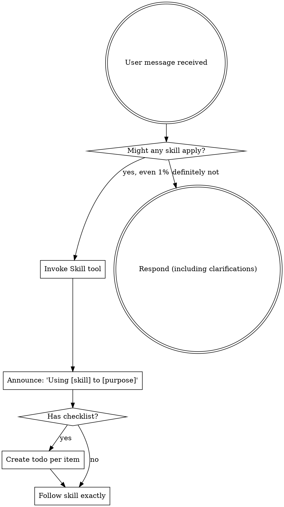

<!-- AUTO-GENERATED from SKILL.md.tmpl — do not edit directly -->
<!-- Regenerate: just build -->

## Preamble (run first)

```bash
# === RKstack Preamble (using-rkstack) ===

# Read detection cache (written by session-start via rkstack detect)
if [ -f .rkstack/settings.json ]; then
  cat .rkstack/settings.json
else
  echo "WARNING: .rkstack/settings.json not found — detection cache missing"
fi

# Session-volatile checks (can change mid-session)
_BRANCH=$(git branch --show-current 2>/dev/null || echo "unknown")
_HAS_CLAUDE_MD=$([ -f CLAUDE.md ] && echo "yes" || echo "no")
echo "BRANCH: $_BRANCH"
echo "CLAUDE_MD: $_HAS_CLAUDE_MD"
```

Use the detection cache and preamble output to adapt your behavior:
- **TypeScript/JavaScript** — see `detection.projectType` (web or node). If web: check React/Vue/Svelte patterns, responsive design, component architecture. If node: CLI tools, MCP servers, backend scripts.
- **Python** — backend/ML/scripts. Check PEP8 conventions, pytest for testing.
- **Go** — backend/infra. Check error handling patterns, go test.
- **Rust** — systems. Check ownership patterns, cargo test.
- **Java/C#** — enterprise. Check build tool (Maven/Gradle/.NET), framework conventions.
- **Ruby** — web/scripting. Check Gemfile, Rails conventions if present.
- **Terraform/HCL** — infrastructure as code. Plan before apply, extra caution with state.
- **Ansible** — configuration management. Check inventory, role conventions, vault usage.
- **Docker/Compose** — containerized. Check service dependencies, .env patterns.
- **justfile** — task runner present. Use `just` commands instead of raw shell.
- **mise** — tool version manager. Versions are pinned — don't suggest global installs.
- **CLAUDE.md exists** — read it for project-specific commands and conventions.
- Read `detection.langs` for project scale (files, lines of code, complexity per language).
- Read `detection.repoMode` for solo vs collaborative.
- Read `detection.services` for Supabase and other service integrations.

## Completion Status

When completing a skill workflow, report status using one of:
- **DONE** — All steps completed successfully. Evidence provided for each claim.
- **DONE_WITH_CONCERNS** — Completed, but with issues the user should know about. List each concern.
- **BLOCKED** — Cannot proceed. State what is blocking and what was tried.
- **NEEDS_CONTEXT** — Missing information required to continue. State exactly what you need.

### Escalation

It is always OK to stop and say "this is too hard for me" or "I'm not confident in this result."

Bad work is worse than no work. You will not be penalized for escalating.
- If you have attempted a task 3 times without success, STOP and escalate.
- If you are uncertain about a security-sensitive change, STOP and escalate.
- If the scope of work exceeds what you can verify, STOP and escalate.

Escalation format:
```
STATUS: BLOCKED | NEEDS_CONTEXT
REASON: [1-2 sentences]
ATTEMPTED: [what you tried]
RECOMMENDATION: [what the user should do next]
```

<SUBAGENT-STOP>
If you were dispatched as a subagent to execute a specific task, skip this skill.
</SUBAGENT-STOP>

<EXTREMELY-IMPORTANT>
If you think there is even a 1% chance a skill might apply to what you are doing, you ABSOLUTELY MUST invoke the skill.

IF A SKILL APPLIES TO YOUR TASK, YOU DO NOT HAVE A CHOICE. YOU MUST USE IT.

This is not negotiable. This is not optional. You cannot rationalize your way out of this.
</EXTREMELY-IMPORTANT>

## Instruction Priority

RKstack skills override default system prompt behavior, but **user instructions always take precedence**:

1. **User's explicit instructions** (CLAUDE.md, GEMINI.md, AGENTS.md, direct requests) — highest priority
2. **RKstack skills** — override default system behavior where they conflict
3. **Default system prompt** — lowest priority

If CLAUDE.md says "don't use TDD" and a skill says "always use TDD," follow the user's instructions. The user is in control.

## How to Access Skills

**In Claude Code:** Use the `Skill` tool. When you invoke a skill, its content is loaded and presented to you — follow it directly. Never use the Read tool on skill files.

**In other environments:** Check your platform's documentation for how skills are loaded.

# Using Skills

## The Rule

**Invoke relevant or requested skills BEFORE any response or action.** Even a 1% chance a skill might apply means you should invoke the skill to check. If an invoked skill turns out to be wrong for the situation, you don't need to use it.



## Red Flags

These thoughts mean STOP — you're rationalizing:

| Thought | Reality |
|---------|---------|
| "This is just a simple question" | Questions are tasks. Check for skills. |
| "I need more context first" | Skill check comes BEFORE clarifying questions. |
| "Let me explore the codebase first" | Skills tell you HOW to explore. Check first. |
| "I can check git/files quickly" | Files lack conversation context. Check for skills. |
| "Let me gather information first" | Skills tell you HOW to gather information. |
| "This doesn't need a formal skill" | If a skill exists, use it. |
| "I remember this skill" | Skills evolve. Read current version. |
| "This doesn't count as a task" | Action = task. Check for skills. |
| "The skill is overkill" | Simple things become complex. Use it. |
| "I'll just do this one thing first" | Check BEFORE doing anything. |
| "This feels productive" | Undisciplined action wastes time. Skills prevent this. |
| "I know what that means" | Knowing the concept ≠ using the skill. Invoke it. |

## Proactive Skill Suggestions

When the user's request matches a workflow stage, suggest the relevant skill:

| User intent | Skill |
|-------------|-------|
| Brainstorming, ideas, design, "let's build" | `brainstorming` |
| Planning, spec, implementation plan | `writing-plans` |
| Bug, error, broken, failing, "why does" | `systematic-debugging` |
| Testing, TDD, "add tests" | `test-driven-development` |
| Code review, review my code | `requesting-code-review` |
| Ship, merge, PR, done, "ready to land" | `finishing-a-development-branch` |
| Safety, caution, production, destructive | `guard` or `careful` |
| Scoped edits, restrict changes, "only touch" | `freeze` |
| Verify, check, prove, "make sure" | `verification-before-completion` |
| Execute plan, follow steps, run plan | `executing-plans` |
| Subagent execution, agent per task, dispatch agents | `subagent-driven-development` |
| Parallel tasks, independent work, run simultaneously | `dispatching-parallel-agents` |
| Worktree, isolated workspace, feature branch | `using-git-worktrees` |
| Respond to review feedback, reviewer said | `receiving-code-review` |
| Documentation update, release docs, post-ship | `document-release` |
| Retrospective, weekly review, what shipped | `retro` |
| Security audit, OWASP, vulnerability, pentest | `cso` |
| Unlock edits, remove freeze, unfreeze | `unfreeze` |
| Write naturally, humanize, no AI slop, public-facing | `humanizer` |
| Review spec/plan with Codex, dual review, second opinion | `dual-review` |
| Browse, open page, check site, navigate, screenshot | `browse` |
| QA, test the app, find bugs, test web | `qa` |
| Bug report, QA report, test report only | `qa-only` |
| Visual audit, design check, spacing, alignment | `design-review` |
| Review design before implementing | `plan-design-review` |
| Design system, colors, typography, new project design | `design-consultation` |
| Import cookies, auth, logged-in testing | `setup-browser-cookies` |
| Performance, speed, Core Web Vitals, load time | `benchmark` |
| Post-deploy, monitor, canary, production check | `canary` |
| Supabase testing, RLS, auth, data consistency | `supabase-qa` |

### Workflow Chain

The typical end-to-end development progression:

```
brainstorming → writing-plans → [executing-plans | subagent-driven-development] → verification-before-completion → requesting-code-review → finishing-a-development-branch → document-release
```

If a skill doesn't exist yet, fall back to your best judgment — but note what skill would have helped.

## Skill Priority

When multiple skills could apply, use this order:

1. **Process skills first** (brainstorming, debugging) — these determine HOW to approach the task
2. **Implementation skills second** — these guide execution

"Let's build X" -> brainstorming first, then implementation skills.
"Fix this bug" -> debugging first, then domain-specific skills.

## Skill Types

**Rigid** (TDD, debugging): Follow exactly. Don't adapt away discipline.

**Flexible** (patterns): Adapt principles to context.

The skill itself tells you which.

## User Instructions

Instructions say WHAT, not HOW. "Add X" or "Fix Y" doesn't mean skip workflows.
