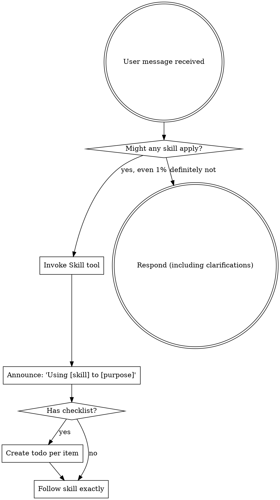

<!-- AUTO-GENERATED from SKILL.md.tmpl — do not edit directly -->
<!-- Regenerate: just build -->

## Preamble (run first)

```bash
# === RKstack Preamble (using-rkstack) ===

# Project detection via scc
_TOP_LANGS=$(scc --format wide --no-cocomo . 2>/dev/null | head -8 || echo "scc not available")
echo "STACK:"
echo "$_TOP_LANGS"

# Framework hints
_HAS_PACKAGE_JSON=$([ -f package.json ] && echo "yes" || echo "no")
_HAS_CARGO_TOML=$([ -f Cargo.toml ] && echo "yes" || echo "no")
_HAS_GO_MOD=$([ -f go.mod ] && echo "yes" || echo "no")
_HAS_PYPROJECT=$([ -f pyproject.toml ] && echo "yes" || echo "no")
_HAS_DOCKERFILE=$([ -f Dockerfile ] && echo "yes" || echo "no")
_HAS_TERRAFORM=$(find . -maxdepth 1 -name "*.tf" -print -quit 2>/dev/null | grep -q . && echo "yes" || echo "no")
echo "FRAMEWORKS: pkg=$_HAS_PACKAGE_JSON cargo=$_HAS_CARGO_TOML go=$_HAS_GO_MOD py=$_HAS_PYPROJECT docker=$_HAS_DOCKERFILE tf=$_HAS_TERRAFORM"

# Repo mode (solo vs collaborative)
_AUTHOR_COUNT=$(git shortlog -sn --no-merges --since="90 days ago" 2>/dev/null | wc -l | tr -d ' ')
_REPO_MODE=$([ "$_AUTHOR_COUNT" -le 1 ] && echo "solo" || echo "collaborative")
_BRANCH=$(git branch --show-current 2>/dev/null || echo "unknown")
echo "REPO_MODE: $_REPO_MODE"
echo "BRANCH: $_BRANCH"

# Project config
_HAS_CLAUDE_MD=$([ -f CLAUDE.md ] && echo "yes" || echo "no")
echo "CLAUDE_MD: $_HAS_CLAUDE_MD"
```

Use the preamble output to adapt your behavior:
- **TypeScript/JavaScript + package.json** — web/fullstack project. Check for React/Vue/Svelte patterns.
- **Python + pyproject.toml** — backend/ML. Check PEP8 conventions.
- **Rust + Cargo.toml** — systems. Check ownership patterns.
- **Go + go.mod** — backend/infra. Check error handling patterns.
- **Dockerfile + Terraform** — infrastructure. Extra caution with state.
- **CLAUDE.md exists** — read it for project-specific commands and conventions.

## Completion Status

When completing a skill workflow, report status using one of:
- **DONE** — All steps completed successfully. Evidence provided for each claim.
- **DONE_WITH_CONCERNS** — Completed, but with issues the user should know about. List each concern.
- **BLOCKED** — Cannot proceed. State what is blocking and what was tried.
- **NEEDS_CONTEXT** — Missing information required to continue. State exactly what you need.

### Escalation

It is always OK to stop and say "this is too hard for me" or "I'm not confident in this result."

Bad work is worse than no work. You will not be penalized for escalating.
- If you have attempted a task 3 times without success, STOP and escalate.
- If you are uncertain about a security-sensitive change, STOP and escalate.
- If the scope of work exceeds what you can verify, STOP and escalate.

Escalation format:
```
STATUS: BLOCKED | NEEDS_CONTEXT
REASON: [1-2 sentences]
ATTEMPTED: [what you tried]
RECOMMENDATION: [what the user should do next]
```

<SUBAGENT-STOP>
If you were dispatched as a subagent to execute a specific task, skip this skill.
</SUBAGENT-STOP>

<EXTREMELY-IMPORTANT>
If you think there is even a 1% chance a skill might apply to what you are doing, you ABSOLUTELY MUST invoke the skill.

IF A SKILL APPLIES TO YOUR TASK, YOU DO NOT HAVE A CHOICE. YOU MUST USE IT.

This is not negotiable. This is not optional. You cannot rationalize your way out of this.
</EXTREMELY-IMPORTANT>

## Instruction Priority

RKstack skills override default system prompt behavior, but **user instructions always take precedence**:

1. **User's explicit instructions** (CLAUDE.md, GEMINI.md, AGENTS.md, direct requests) — highest priority
2. **RKstack skills** — override default system behavior where they conflict
3. **Default system prompt** — lowest priority

If CLAUDE.md says "don't use TDD" and a skill says "always use TDD," follow the user's instructions. The user is in control.

## How to Access Skills

**In Claude Code:** Use the `Skill` tool. When you invoke a skill, its content is loaded and presented to you — follow it directly. Never use the Read tool on skill files.

**In other environments:** Check your platform's documentation for how skills are loaded.

# Using Skills

## The Rule

**Invoke relevant or requested skills BEFORE any response or action.** Even a 1% chance a skill might apply means you should invoke the skill to check. If an invoked skill turns out to be wrong for the situation, you don't need to use it.



## Red Flags

These thoughts mean STOP — you're rationalizing:

| Thought | Reality |
|---------|---------|
| "This is just a simple question" | Questions are tasks. Check for skills. |
| "I need more context first" | Skill check comes BEFORE clarifying questions. |
| "Let me explore the codebase first" | Skills tell you HOW to explore. Check first. |
| "I can check git/files quickly" | Files lack conversation context. Check for skills. |
| "Let me gather information first" | Skills tell you HOW to gather information. |
| "This doesn't need a formal skill" | If a skill exists, use it. |
| "I remember this skill" | Skills evolve. Read current version. |
| "This doesn't count as a task" | Action = task. Check for skills. |
| "The skill is overkill" | Simple things become complex. Use it. |
| "I'll just do this one thing first" | Check BEFORE doing anything. |
| "This feels productive" | Undisciplined action wastes time. Skills prevent this. |
| "I know what that means" | Knowing the concept ≠ using the skill. Invoke it. |

## Proactive Skill Suggestions

When the user's request matches a workflow stage, suggest the relevant skill:

| User intent | Skill |
|-------------|-------|
| Brainstorming, ideas, design, "let's build" | `brainstorming` |
| Planning, spec, implementation plan | `writing-plans` |
| Bug, error, broken, failing, "why does" | `systematic-debugging` |
| Testing, TDD, "add tests" | `test-driven-development` |
| Code review, review my code | `requesting-code-review` |
| Ship, merge, PR, done, "ready to land" | `finishing-a-development-branch` |
| Safety, caution, production, destructive | `guard` or `careful` |
| Scoped edits, restrict changes, "only touch" | `freeze` |
| Verify, check, prove, "make sure" | `verification-before-completion` |

If a skill doesn't exist yet, fall back to your best judgment — but note what skill would have helped.

## Skill Priority

When multiple skills could apply, use this order:

1. **Process skills first** (brainstorming, debugging) — these determine HOW to approach the task
2. **Implementation skills second** — these guide execution

"Let's build X" -> brainstorming first, then implementation skills.
"Fix this bug" -> debugging first, then domain-specific skills.

## Skill Types

**Rigid** (TDD, debugging): Follow exactly. Don't adapt away discipline.

**Flexible** (patterns): Adapt principles to context.

The skill itself tells you which.

## User Instructions

Instructions say WHAT, not HOW. "Add X" or "Fix Y" doesn't mean skip workflows.
